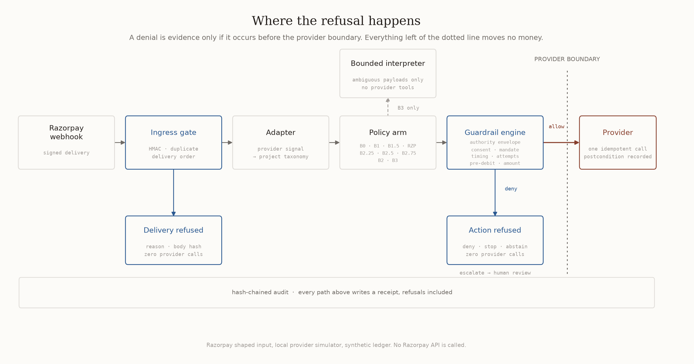

# MandateGuard Policy Lab

**MandateGuard compares nine recovery policy arms — including one bounded interpreter arm — head to head on the same frozen scheduled UPI AutoPay failure ledger, executes what each arm is permitted to execute, refuses what its guardrails prohibit, and proves both decisions before anything reaches the provider boundary.**

> **Scope, stated before anything else.** Every number in this repository is a **synthetic counterfactual** over a frozen generated ledger. The **offline path** uses a **synthetic local simulator** — it does not talk to Razorpay, no production money moves, and no customer is contacted. Input to that path is a **Razorpay shaped signed test webhook fixture**. The default benchmark is **fully deterministic and offline**; the bounded real interpreter is an **optional mode**, and in neither mode can the interpreter authorize a payment action or bypass a guardrail.


> **Optional provider-backed proof.** RecoveryTruth is a separate **Razorpay Test Mode-only** execution path. It performs fresh provider reads, applies a write-time fence, can create a **Standard Payment Link fallback**, reconciles ambiguous writes, and independently verifies the captured payment. It refuses `rzp_live_` credentials. A Payment Link fallback is **not** an AutoPay retry. The frozen benchmark and every rupee figure reported by it remain synthetic.

Every arm is executable policy code, not a description of one: it decides whether to retry a failed AutoPay debit and, when it decides yes, actually executes that retry against the provider adapter, so an arm's cost is paid in simulated provider calls rather than asserted in prose. Where the arms differ is what each is allowed to see and what it is bound not to do: from `B0` (does nothing) through ungated retry, to Razorpay's own published **card** retry schedule implemented and run as a benchmark arm (`RZP`), up to `B3`, which may consult a bounded interpreter on ambiguous failures and is still refused authority to widen what it can execute. In the default benchmark that interpreter is deterministic and offline. `outputs/real_interpreter_evidence.json` is a captured run of the **optional** real-model mode, kept as evidence that the same bound holds against a live model — its answer still cannot move a decision past the guardrail beneath it.

Razorpay already ships recovery for UPI AutoPay, including a configurable retry engine in beta. This project does not compete with it on retry strategy and would lose if it tried. What a configurable retry engine cannot answer about itself is the question this project exists to answer instead:

> Before this retry configuration is deployed, what will it recover, what legitimate recovery will it refuse, how many prohibited debits will it attempt, and can every refusal be proven afterwards?

MandateGuard answers that on a frozen synthetic ledger. It is not a recovery engine competing on recovered rupees alone — it is nine recovery policy arms, decided, executed, and proven side by side, including **Razorpay's own published card retry schedule run as a benchmark arm**, with every allow and every refusal traceable through a hash-chained audit receipt before the provider boundary. See [`docs/competitive_position.md`](docs/competitive_position.md) for the full positioning and for what would weaken it.

> ## **AI interprets. Policy authorizes. Provider executes. Evidence proves.**
>
> The bounded interpreter never holds payment authority. It may read an ambiguous failure and propose a reading with a confidence score; it cannot authorize a debit, widen an authority envelope, change consent, or reach the provider. That boundary is enforced in `bailiff/guardrails.py` and attacked directly in `tests/test_adversarial.py`, where a fully compromised interpreter returning maximum confidence on the most permissive reading available still cannot move a revoked mandate past the guardrail.

> **The webhook gate authenticates. The bounded interpreter interprets. The policy engine decides. The provider adapter executes. The audit chain proves.**

## Run it in one command

```bash
pip install -r requirements.txt
python3 scripts/demo60.py          # the sixty second proof, no setup beyond this
```

That is the whole judge path. `scripts/demo60.py` needs no API key, no network, and no Streamlit: it runs the same modules the benchmark uses and prints a forged webhook refused at ingress, a permitted retry making exactly one simulated provider call, an ambiguous case where the bounded interpreter abstains with **zero** provider calls, a timeout routed to human review, and audit tampering failing verification.

On Windows, double-click `run_demo.bat` (or run `run_demo.bat` in CMD).

### Live Deployments & Quick Links
- 🌐 **Live Interactive Web Simulator**: [https://harshithasatthish.github.io/mandateguard-policy-lab/](https://harshithasatthish.github.io/mandateguard-policy-lab/)
- 📦 **GitHub Repository**: [https://github.com/HarshithaSatthish/mandateguard-policy-lab](https://github.com/HarshithaSatthish/mandateguard-policy-lab)
- 📋 [**Official Submission Pack & Judge Defense Guide**](SUBMISSION_PACK.md)
- 🏢 [**Market-Ready Enterprise Architecture & Deployment Guide**](MARKET_READY_ARCHITECTURE.md)
- ⚡ **Vercel Serverless Ready**: `vercel.json` and `api/index.py` for 1-click cloud hosting
- 🖥️ **Interactive Evidence UI**: `streamlit run app.py` (or double-click `run_app.bat`)
- 🔍 **Provider Proof Viewer**: `streamlit run provider_proof_app.py` (or double-click `run_proof_app.bat`)
- 🛡️ **Full Verification**: `verify_all.bat` (Windows) or `./scripts/verify_all.sh` (Linux)

Python 3.11 or newer. To run the full benchmark and the verification gates instead, see [Repository commands](#repository-commands) and [Verification](#verification).

## How it fits together



Generated by `scripts/make_architecture.py`. Everything left of the dotted line moves no money; both refusal paths terminate there, and every path writes a receipt.

## The input is authenticated before any policy reads it

Everything downstream proves that an *action* was authorised. None of it is worth anything if the *input* is not, because an attacker who can post to the webhook endpoint and be believed does not need to defeat a single guardrail: the recovery agent will be driven by a failure they wrote. Authority control that begins after the event has been trusted begins one step too late.

`bailiff/webhook.py` implements Razorpay's published webhook contract as the first boundary:

| Control | Behaviour |
|---|---|
| Signature | `HMAC-SHA256` over the **raw** body keyed by the webhook secret, read from the `X-Razorpay-Signature` header |
| Constant-time comparison | Signatures are compared with `hmac.compare_digest`, never `==`, so a failed comparison cannot leak through its timing how many leading characters were correct. This is what HMAC verification requires; it is cheap and it is easy to get wrong |
| Delivery order | Razorpay does not guarantee webhook ordering. Order is taken from each event's own `created_at` per subscription, not from arrival, and a subscription that reaches a terminal event closes for good — so a stale `payment.failed` cannot retry a cycle that already settled, or debit a mandate the customer has since cancelled |
| Raw body discipline | Passing a parsed payload raises, because re-serialising changes key order and whitespace and would verify the wrong bytes |
| Duplicate delivery | `x-razorpay-event-id` is unique per event; a redelivery is authentic but is not processed twice |
| Secret rotation | More than one secret may be live so a retry signed before a rotation still verifies, and the generation that matched is recorded |
| Replay window | A delivery far outside its window, or stamped in the future, is refused |
| Evidence | A refused delivery is recorded with its reason and body hash. A silent drop is indistinguishable from a bug |

A payload that fails verification is never normalised, never diagnosed and never scored. `tests/test_webhook_ingress.py` attacks this boundary 42 ways: forged and absent signatures, bodies tampered after signing, signatures replayed onto a different payload, a captured body replayed under a freshly minted event-id header, non-ASCII signature headers, retired secrets, malformed bodies under a valid signature, header case games, and the ordering inversions above.

See [Razorpay's webhook validation docs](https://razorpay.com/docs/webhooks/validate-test/) for the contract this implements.

The default benchmark is synthetic: it is driven through a Razorpay-shaped scheduled AutoPay test payload adapter and a **local provider simulator**. That offline path does not call Razorpay APIs and does not claim simulated results as Razorpay revenue. Separately, RecoveryTruth's optional **Razorpay Test Mode** path does perform real Test Mode reads and can create a Standard Payment Link fallback (not an AutoPay retry). See the scope callouts at the top of this README.

## The headline result

**Evaluation dataset: synthetic failure ledger. Provider: local simulator. Not Razorpay merchant transactions.**

The comparison here is **Fixed Retry Reference Policy vs Reason-Aware Policies**, and the reference policy needs stating precisely before any number is read.

Razorpay documents a fixed retry schedule for its **card** model: *"In a T+3 days cycle, we will retry the payment thrice. That is, once every day for 3 days, excluding the date of the charge."* MandateGuard implements exactly that as the `RZP` arm — a **fixed retry reference policy**, named after where the timing came from, not a model of Razorpay's product.

> **We use Razorpay's documented fixed card retry schedule as a reference policy. It does not reproduce or benchmark Razorpay's current Intelligent UPI Retry Engine, and MandateGuard has not been evaluated against Razorpay's production decision logic.** Razorpay ships Intelligent Revenue-Protect for UPI AutoPay, in which merchants can configure retry strategies; that production engine is outside this benchmark.

**On this synthetic ledger, under the tested policies, the fixed reference schedule is Pareto dominated in all three regimes.** Reading the failure reason recovers more money while moving substantially less prohibited value — six times less in the terminal regime. In our evaluation no weighting of the two metrics prefers the purely temporal schedule. That is a statement about nine policies on one generated ledger. It is not a claim about Razorpay's production system, which this project has never run against and does not measure.

Two qualifications, both enforced by tests so they cannot be quietly dropped. First, the schedule is documented for the **card** model. Applying that card schedule to a scheduled AutoPay ledger is an explicit benchmark assumption, not a statement about Razorpay's UPI retry behaviour or production engine. Second, a fixed temporal schedule cannot see a failure reason, so this reference arm does not try to. The finding is not that Razorpay's production system is wrong; it is that **on this synthetic ledger, reason-aware policies outperform the tested fixed temporal reference under the stated metrics.** Evaluating that policy trade-off is what this repository does.

Full positioning, including Razorpay's Agent Studio "Subscription Recovery" agent and what would weaken this argument, is in [`docs/competitive_position.md`](docs/competitive_position.md).

## The problem, in the direction it actually fails

Recovery systems are usually scored on money recovered. The publicly documented complaint themes around recurring payments in India run the other way: unexpected and unauthorised deductions, and auto-pay charges customers did not anticipate. Two independent complaint aggregators show those themes in their top five. The sampled complaint sources did not contain complaints about too little recovery — a statement about those samples, not a claim about every customer everywhere.

So a benchmark that optimises recovered money is optimising against the direction the public record complains about. The evidence, its sampling caveats, and the explicit limits of what it establishes are in [`docs/problem_evidence.md`](docs/problem_evidence.md). None of it feeds any number in `outputs/` — the ledger is synthetic and its harm model is a declared assumption, swept in [`ROBUSTNESS.md`](ROBUSTNESS.md).

## The central thesis

An arm can always recover more by retrying indiscriminately: ignoring mandate state, ignoring customer consent, and exhausting the attempt budget. Scoring recovery alone rewards exactly that. MandateGuard measures both directions at once, so neither over-execution nor over-refusal can hide:

| Metric | Meaning |
|---|---|
| `incremental_recovered_inr` | Recovery above the no intervention control on the same ledger |
| `legitimate_recovery_forgone_inr` | Counterfactual recoverable value blocked by an explicit guardrail |
| `protected_value_by_denial_inr` | Value associated with prohibited actions that were not sent to the provider |
| `violations` | Actions rejected by an independent checker contract |
| `recovered_per_permitted_action_inr` | Recovery efficiency among permitted executable actions |
| `abstention_rate` | Share of cases where the bounded interpreter abstained and routed to human review |
| `realized_harm_inr` | Value of prohibited actions that actually reached the provider |
| `prohibited_execution_rate` | Share of harm bearing cases on which the arm executed anyway |
| `violation_cost_inr` | Configured project cost assigned to each independent checker violation |
| `net_value_inr` | Incremental recovered value minus violation cost, human review cost, and interpreter cost |
| `net_value_harm_priced_inr` | Incremental recovered value minus realized harm times the configured harm multiplier, minus human review and interpreter cost |

All financial figures are simulated counterfactuals from a frozen synthetic ledger. They must never be described as observed production revenue.

### What a prohibited action costs

The arm ordering is not a property of the policies alone. It is a joint property of the policies and of what a prohibited action is assumed to cost, and that assumption is the weakest number in the project. Two pricings are therefore reported and neither is presented as the truth.

The flat pricing charges a fixed sum per independently detected breach, regardless of the amount at stake. The harm pricing charges the money the prohibited action actually moved, times a configured multiplier whose default of 1.0 is a lower bound rather than an estimate, because a prohibited debit must at minimum be reversed. `scripts/make_sensitivity_chart.py` sweeps both prices across a grid and `outputs/sensitivity.json` records which arm wins at each point, so a reader who rejects the project default can read their own answer off the curve.

The substantive economic claim is a threshold, not a verdict: under a flat per breach charge, reason gating alone is competitive, because a flat charge is indifferent to the size of the debit it prices. The fully guarded arms win once a prohibited action is charged the money it moved.

### How latent harm is generated

Compliance exposure in the fixture is drawn independently of the failure reason. This is deliberate and load bearing. If latent harm were a pure function of the normalized reason, then an arm gating on the reason code alone would capture every unit of harm avoidance by construction, and every control above it could only destroy recovery. The benchmark would return a fixed answer before any policy ran.

A bank can return insufficient funds on a mandate the customer separately paused, on a customer who separately opted out, on an attempt already over the authority cap, or without a valid pre debit notice. Those states are visible only to the full guardrail profile, so the fixture draws them from their own independent draws. `scripts/check_release.py` rejects a release whose fixture is degenerate in this respect.

## Nine policy arms

The benchmark always uses this order:

```text
B0, B1, B1.5, RZP, B2.25, B2.5, B2.75, B2, B3
```

| Arm | Role | Behavior |
|---|---|---|
| B0 | No intervention control | Stops without attempting recovery |
| B1 | Ungated retry baseline | Retries without reading the failure reason or applying guardrails |
| B1.5 | Deterministic retry only | Retries only normalized transient reasons; stops for terminal or ambiguous reasons; no interpreter |
| B2.25 | Timing frontier | Applies timing while relaxing project policy gates for diagnosis, consent, attempt, mandate, pre debit, expiry, and amount review; diagnostic only |
| B2.5 | Timing plus attempt frontier | Adds retry gap and attempt budget to the B2.25 profile; diagnostic only |
| B2.75 | Timing plus attempt plus consent frontier | Adds consent and opt out gates; still relaxes other full profile controls; diagnostic only |
| B2 | Deterministic policy engine | Uses the project taxonomy, timing, consent, attempt, amount, and mandate gates |
| B3 | Bounded interpreter | Interprets only ambiguous provider payloads and proposes an action; it has no provider tools and no authority to bypass the engine |

B1 and B1.5 are deliberately ungated baselines. Their policy violations are measured by the independent checker. B2.25, B2.5, and B2.75 are labelled frontier arms used to expose where individual controls change the recovery versus violation tradeoff. B2 and B3 are the guarded arms. In offline mode B3 uses a deterministic bounded interpreter implementation over the raw payload. When validated confidence is below the configured threshold, B3 emits `ABSTAIN`, routes to human review, and makes zero provider calls. If B3 does not beat B2 on the target regime, the result is reported rather than hidden.

## Scope and authority

The scope is scheduled UPI AutoPay debit failure events in INR. One off UPI declines, cards, refunds, write offs, mandate creation, mandate cancellation, settlement reconciliation, and unrestricted customer messaging are outside the MVP.

Every event carries a correlation identifier, mandate identifier, scheduled execution identifier, recovery case identifier, attempt count, consent snapshot, failure payload, normalized project reason, MCC, scheduled execution time, and pre debit state. The event is rejected if it is outside the scheduled AutoPay scope or uses a non INR currency.

The authority envelope can only attenuate. A child envelope cannot add actions, increase the amount ceiling, increase remaining attempts, extend expiry, or change the mandate and scheduled execution identities.

## Guardrails

The runtime applies the controls before any provider call:

| Control | Runtime behavior | Provenance |
|---|---|---|
| Consent | Opted out customers cannot receive automated contact actions | Project policy and configured source |
| Mandate state | Revoked, cancelled, paused, and expired mandates cannot execute recovery actions | Project policy pending source pin where applicable |
| Attempt budget | Retry is stopped at the configured authority cap | Versioned project policy; external source must be pinned before regulatory wording |
| Non peak timing | A retry must carry a proposed execution time inside a configured permitted window | Configured policy with source tier |
| Pre debit notice | Retry requires valid pre debit state and sufficient lead time unless an explicit MCC exemption applies | Configured rule with provenance |
| Amount authority | An action cannot exceed the authority envelope or policy ceiling | Project authority policy |
| Ambiguity | Unknown or conflicting diagnosis is abstained or escalated; it never authorizes money movement | Project safety policy |
| Economic cost | Violations and human reviews are priced as explicit configurable project assumptions | Versioned rules catalog |

| Terminal reason | Revoked, closed, risk rejected, and opted out reasons stop automated retry | Project failure taxonomy |
| Postcondition | A provider timeout with unknown state routes to human review before another action | Runtime safety policy |

The normalized failure taxonomy is a project taxonomy. It is not presented as an official universal NPCI taxonomy. Timing, retry, pre debit, and confidence rules are loaded from `bailiff/rules.json` with source tier and effective date metadata.

## Architecture

```text
Razorpay shaped scheduled AutoPay failure payload
              |
              v
Razorpay payload adapter, raw signal, and reason taxonomy
              |
              v
B0 / B1 / B1.5 / RZP / B2.25 / B2.5 / B2.75 / B2 / B3 policy arm
              |
              v
bounded interpreter proposal, if applicable
              |
              v
authority envelope and deterministic guardrail engine
        |                         |
        | deny or stop             | allow
        v                         v
hash chained receipt       idempotency gate
zero provider calls              |
                                 v
                         Razorpay shaped provider simulator
                                 |
                                 v
                         postcondition and audit
                                 |
                                 v
                         benchmark metrics and report
```

## Repository commands

Install and test:

```bash
python3 -m pip install -e '.[test]'
./scripts/test.sh
```

Run the sixty second proof. This is the demo to open a pitch with: one signed Razorpay webhook, one refusal, one permitted recovery, and four ways the runtime fails safely.

```bash
python3 scripts/demo60.py
```

Run the fuller offline evidence demo. It starts with denial, then allowed recovery, explicit ABSTAIN, timeout, and audit tamper-evident verification (a mutated old event fails the hash chain):

```bash
./scripts/demo.sh
```

To exercise the optional real bounded interpreter on the ambiguous B3 case, install the optional extra and provide an OpenAI compatible endpoint. The client is not tied to OpenAI's own service — any host that speaks the same chat-completions contract works, including free tiers with no card required:

```bash
python3 -m pip install -e '.[test,interpreter]'

# any OpenAI-compatible host works; Groq's free tier is used below
export OPENAI_API_KEY=<your key>
export MANDATEGUARD_INTERPRETER_BASE_URL=https://api.groq.com/openai/v1
export MANDATEGUARD_INTERPRETER_MODEL=openai/gpt-oss-20b
python3 -m bailiff.demo --real-interpreter
```

The real mode is optional and is not used for the deterministic final benchmark. It calls the model only for ambiguous B3 payloads. The model receives no provider tools or credentials, and low confidence or any model failure still becomes ABSTAIN with zero provider calls. `outputs/real_interpreter_evidence.json` is a captured run against Groq's free `openai/gpt-oss-20b` endpoint: the model returned `UNKNOWN_OR_CONFLICTING` at 0.9 confidence, and the case still escalated to `HUMAN_REVIEW_REQUIRED` with zero provider calls — the model is consulted, it does not gain authority.

Run the final offline benchmark and generate the report:

```bash
./scripts/evaluate.sh
./scripts/release_check.sh
```

The final script uses a fixed 20 seed list and generates `outputs/per_seed.json`, `outputs/aggregate.json`, `outputs/evidence_ledger.json`, `outputs/evidence_manifest.json`, `outputs/manifest.json`, `outputs/anti_gaming.json`, `outputs/breakeven.json`, `outputs/sensitivity.json`, `outputs/frontier.png`, `outputs/sensitivity.png`, `outputs/report.md`, and `FINDINGS.md`. The shipped evidence ledger is a deterministic one seed and one regime sample; the full evidence ledger is generated under `outputs/generated/` for local verification and is excluded from the release package. Every decision row carries its ledger hash, audit hashes, provenance, forgone value, and protected value. The report and findings are generated from outputs rather than hand typed. The API freezes and reuses its experiment ledger instead of regenerating a different ledger during a run.

## Optional evidence UI

The additive `app.py` provides five read only evidence screens: Control Room, Case Timeline, Policy Compare, Failure Lab, and Exception Queue. It reads the generated `outputs/` files and does not generate a new ledger or change benchmark results. The command line demo, tests, and release checks do not require Streamlit.

```bash
python3 -m pip install -e '.[ui]'
streamlit run app.py
```

The same UI ships as a self-contained container for judging without a local Python environment — it carries only the generated evidence and the code to display it, needs no secret, and writes nothing. See [`docs/DEPLOYMENT.md`](docs/DEPLOYMENT.md) for free public hosting options (Hugging Face Spaces, Streamlit Community Cloud).

```bash
docker build -t mandateguard-lab .
docker run --rm -p 8501:8501 mandateguard-lab
```

The UI shares its palette and its arm colouring with the generated charts through `bailiff.chartstyle`, so an arm is the same colour on screen as it is in `frontier.png`: blue is fully guarded, oxblood is ungated, neutral ink is a diagnostic relaxation. Colour is never decoration here, it encodes how much authority an arm gave up. The Case Timeline shows one case as nine rows of receipts rather than nine columns of captions, because the decisive column is whether a provider call happened at all. The Failure Lab runs the demo live and marks each runtime contract satisfied or not against the line the runtime actually emitted.

If Streamlit is unavailable, use `./scripts/demo.sh` and the generated Markdown report instead. The UI is a presentation layer for the deterministic synthetic benchmark and local provider simulator, not a live payment console.

### Source lineage, exception queue, and action provenance

Three of those screens exist to answer a reviewer's question rather than a operator's. **Source lineage** (inside Case Timeline) shows, for one decision, where each input came from and what kind of claim it is — `FACT_FROM_FIXTURE`, `PROJECT_POLICY`, `MODEL_INTERPRETATION`, `GUARDRAIL_DECISION`, or `SIMULATED_PROVIDER_RESULT`. Collapsing those five is how a demo starts implying a model decided something it did not. **Action provenance** (also inside Case Timeline) shows the chain in the order the runtime actually decided it, from payload hash through to audit receipt; the interpreter step appears only when a bounded interpreter was genuinely consulted, because an empty interpreter step on a deterministic arm invites the reader to assume a model was involved. **Exception Queue** lists the cases a human would have to look at, derived entirely from reason codes the runtime already recorded, with deterministic filters and a total ordering.

All three are implemented as pure functions in `bailiff/lineage.py`. They compute no benchmark metric, open no ledger, call no provider, write no file, and open no socket, and none of that is left to good intentions:

| Guarantee | How it is enforced |
|---|---|
| Never calls the provider simulator | Every public method on `ReplayProvider` is replaced with a trap, then the full queue is built |
| Never mutates a canonical output | All 13 canonical artefacts are hashed before and after a full render pass |
| Never reaches the network | `socket.connect`, `socket.create_connection` and `socket.getaddrinfo` are blocked during rendering |
| Never writes to disk | `app.py` and `bailiff/lineage.py` are scanned for write operations |
| Never regenerates a chart | `app.py` is scanned for `savefig` and the chart generators |
| Invents nothing | A field the evidence lacks renders as `not present in fixture`, asserted per row |
| Denials stay denials on screen | Every non executing row must show `provider_calls = 0`, and a contradiction is surfaced, not smoothed |

A field this repository's evidence genuinely does not carry — mandate id, scheduled execution id, the wire timestamps — is displayed as missing rather than omitted, so a reviewer can tell the difference between "absent from the fixture" and "not shown".

### Design inspiration and its boundary

Rillet's public Aura and MCP material was used as design inspiration for contextual data access, reviewable workflow actions, permission boundaries, and auditability. MandateGuard does not integrate with Rillet. It applies those ideas narrowly to scheduled AutoPay recovery policy evaluation.

There is no Rillet dependency, credential, endpoint, or runtime reference in this repository, and the name appears nowhere in the product, the UI, the policy arm list, the API, or the benchmark.

## Evidence a judge should inspect

The sequence below leads with prevention rather than recovery, deliberately. The ungated arms in this benchmark recover more than the guarded ones, and that result is in the report; opening on a recovery figure our own evidence beats would be the wrong first claim.

1. A denied retry receipt showing the reason, provenance, and zero provider calls. This is the load bearing artefact: the refusal happened before the provider boundary, not as a note written afterwards.
2. An allowed retry with a provider call ID and postcondition state.
3. A counterfactual comparison of B0, B1, B1.5, RZP, B2.25, B2.5, B2.75, B2, and B3 on the same case.
4. A timeout whose postcondition is unknown and which routes to human review.
5. An audit tampering demonstration that changes one old event and makes verification fail.
6. The generated frontier chart, which plots incremental recovery against the prohibited value each arm actually moved and marks which arms are dominated outright. At the shipped configuration the bounded interpreter arm B3 dominates the deterministic guarded arm B2 in every regime: identical zero harm, more recovery. Under the fixture sweep that dominance holds in every terminal and ambiguous observation and is within noise on the transient regime; see `ROBUSTNESS.md`.
7. The economic break even analysis and findings document showing recovered INR, legitimate recovery forgone, protected value, realized harm, efficiency, violations, abstention, net value, and per seed spread.
8. The generated sensitivity chart showing which arm wins as the price of a prohibited action is swept, and the crossover at which the fully guarded arms overtake reason gating alone.
9. `ROBUSTNESS.md`, which reports where these conclusions survive a hostile fixture and where they do not.
10. `python3 scripts/interpreter_ablation.py` — the "does the AI earn its place" question answered mechanically: B2 and B3 on the same frozen aggregate, same guardrails, same execution boundary, so the only difference left is the bounded interpreter. Whatever the delta is, it is printed, not asserted.
11. `python3 scripts/refusal_regret.py` — every refusal reason with the recoverable value it forgot and the harm-bearing value it protected, including the rows where a control cost more than it protected. A system that publishes its own regret table is harder to accuse of grading itself.

## Verification

Four gates, in increasing strength. The first two are fast enough to run on every change; the last two are what should be run before submitting.

```bash
./scripts/test.sh              # 299 tests: unit, contract, adversarial, property based
python3 scripts/mutation_check.py   # does the suite actually catch the bugs it names
./scripts/release_check.sh     # packaging, determinism, generated artefacts
./scripts/verify_all.sh        # all of the above plus the fixture assumption sweep
```

### What `SHA256SUMS.txt` promises, and what it does not

`SHA256SUMS.txt` covers every shipped file. It is the hash of the **archive contents**, and it is expected to verify in two places:

```bash
sha256sum -c SHA256SUMS.txt    # immediately after extracting the archive
./scripts/verify_all.sh        # and again after the full verification workflow
```

`verify_all.sh` re-runs that check itself as its closing step, so a verification run that quietly corrupted a shipped file cannot pass.

It is deliberately **not** a claim that regenerating every artefact elsewhere reproduces the same bytes. Three shipped files are rendered images:

| Artefact | Reproducible within one environment | Reproducible across environments |
|---|---|---|
| `outputs/architecture.png` | yes | **no** |
| `outputs/frontier.png` | yes | **no** |
| `outputs/sensitivity.png` | yes | **no** |
| every other shipped file (source, docs, JSON evidence, `ROBUSTNESS.md`) | yes | yes |

Rendered PNGs are **not byte reproducible across environments**: Matplotlib version, FreeType version and font fallback all change the output bytes. That was measured rather than assumed — from identical input data and identical source, Matplotlib 3.10.9 and 3.11.1 render all three files differently. Pinning that away honestly would require pinning the renderer, the backend, the font file and the locale and then demonstrating it on more than one platform, which this project does not claim to have done.

The contract is therefore drawn where it can be kept. Verification never regenerates a chart, so the manifest survives verification on any machine; `scripts/evaluate.sh` is the regeneration entry point, and on a different Matplotlib it will legitimately change those three hashes. If you regenerate, regenerate `SHA256SUMS.txt` in the same environment and re-ship both. `tests/test_chart_checksum_policy.py` and a runtime guard inside `verify_all.sh` keep chart generation out of the verification path so this boundary cannot be erased by a later edit.

**Adversarial suite** (`tests/test_adversarial.py`). The safety claim is narrow and therefore attackable, so it is attacked. Prompt injection strings are planted in provider payload fields, the interpreter is replaced with a fully compromised one that returns maximum confidence on the most permissive reading available, and it is then shown that a revoked mandate stays denied and an opted out customer stays uncontacted regardless. Malformed, out of taxonomy, out of range and crashing interpreter outputs all fail closed to `ABSTAIN` with zero provider calls. The authority envelope is attacked directly for action widening, ceiling raising, attempt granting and expiry extension.

**Property based suite** (`tests/test_properties.py`). The example tests check cases someone thought of; these check cases nobody thought of. Hypothesis generates events across every field a guardrail reads and asserts the invariants over the whole input space: a non allow decision never reaches the provider, a provider call always implies a permitted executable action, every run leaves a verifiable audit chain, and the money metrics conserve — every rupee of latent harm is either protected or realized, never both and never neither.

**Mutation check** (`scripts/mutation_check.py`). A green suite proves nothing until you know it can go red. Fourteen known defects are reintroduced into a scratch copy of the package, one at a time, and the suite must fail on each. Two of them are the metric comparability bug this project actually shipped and later fixed, kept so the suite can never quietly lose the ability to detect it again.

**Fixture assumption sweep** (`scripts/fixture_sensitivity.py`, generating `ROBUSTNESS.md`). The sharpest attack on this project is not a bug: it is that the harm model was chosen by the same person who wanted the guardrails to look good. The assumptions are therefore swept across fifteen settings, deliberately including settings hostile to the design, and every conclusion is reported at every setting. The result is not a clean sweep and is not presented as one. See `ROBUSTNESS.md`.

## Honest limitations

The frozen benchmark licenses one kind of claim and not another. It supports "arm A trades recovery against prohibited value differently than arm B, under a declared fixture whose compliance exposure is drawn independently of the failure reason" — a controlled comparison. It never supports a real-world effect size, and no result in this repository should be quoted as one. Where this project grounds itself outside its own simulator is deliberately the **execution and refusal axis**, not the estimation axis: real Razorpay Test Mode execution behind a pre-write fence, an independently verified captured-payment postcondition, and a recorded already-paid refusal that provably created nothing (`0 -> 0`). An entry that validates estimation on external data and an entry that proves execution and denial against the real provider are answering the same "it's all your own simulator" objection on different axes; this repository claims only its own.

The frozen MandateGuard benchmark outcomes are synthetic. In that offline path the provider is a local simulator, the input adapter is Razorpay-shaped, and no Razorpay API is called. No production customer is contacted and no real money is moved. RecoveryTruth is a separate optional path: with `rzp_test_` credentials it performs real Razorpay Test Mode reads and may create a Standard Payment Link fallback; it refuses `rzp_live_` keys and is not an AutoPay retry. That Test Mode evidence is currently **VERIFIED_TEST_MODE_EVIDENCE_CAPTURED**. The real bounded interpreter path is optional, requires an OpenAI compatible environment, and must be run separately from the deterministic final benchmark. The deterministic offline interpreter remains the reproducible default. External regulatory sources remain at their declared provenance tier until the exact primary circular documents are pinned and hashed.

The current system is intended for a hackathon proof of bounded recovery policy evaluation. It is not a multi tenant payment service, a collections product, a settlement system, or a replacement for Razorpay recovery features.

## Origin story

The design is informed by an authority attenuation problem in the author’s earlier Rakshex work: a child action could accidentally inherit broader authority than its parent intended. MandateGuard applies the lesson to scheduled recovery. Continuing a workflow must never increase its authority.

## Source notes

The public NPCI AutoPay page is the baseline source for recurring mandate controls and pre debit notification information. Retry caps and non peak timing windows are treated as configurable rules with provenance until their exact primary circular PDF is pinned locally. See `docs/system_spec.md` for the full source classification and submission narrative.
